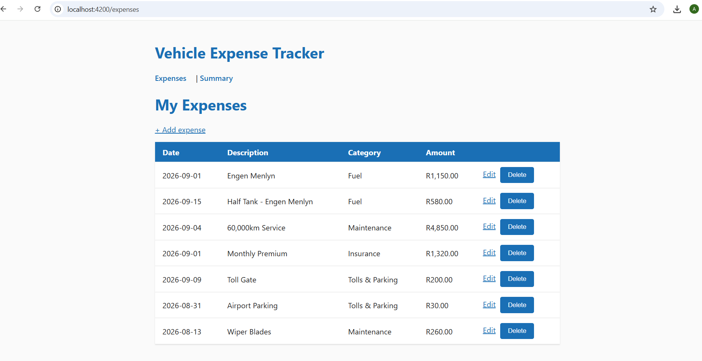
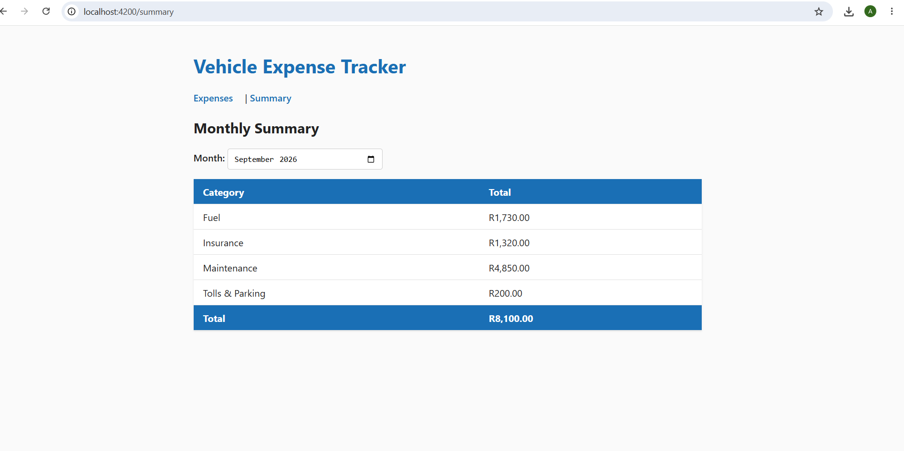
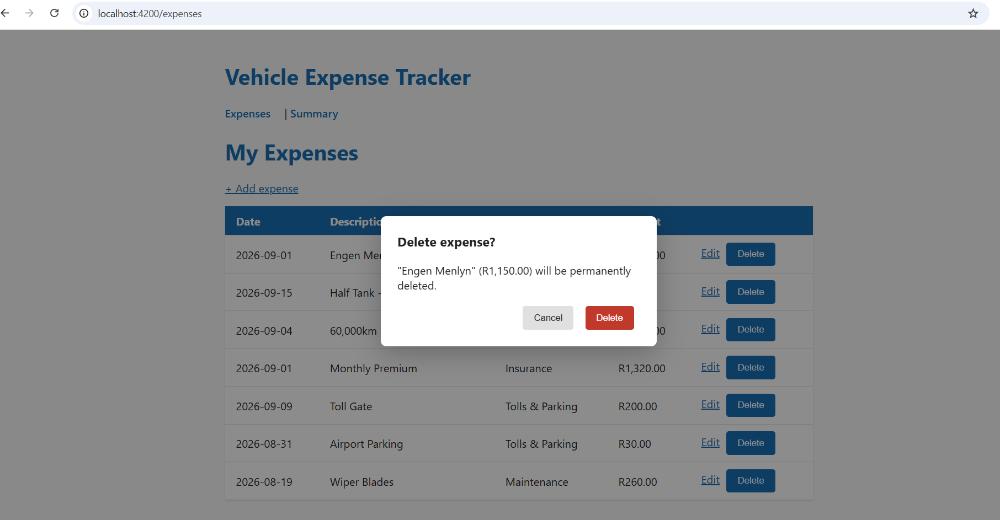
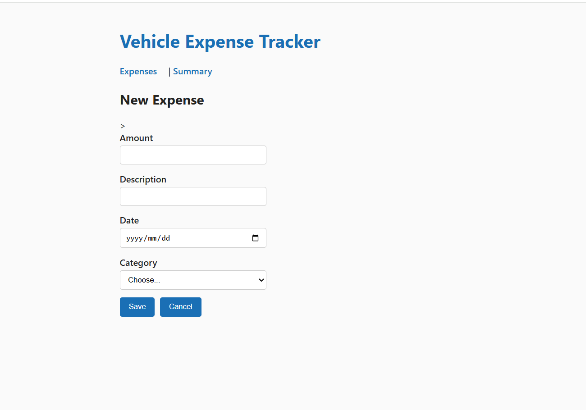
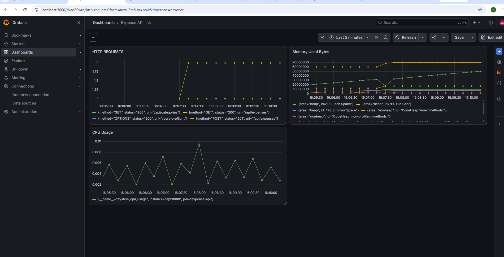

# Vehicle Cost Tracker

A full-stack web application for tracking personal vehicle running costs — fuel, maintenance, insurance, tolls — with monthly per-category summaries and live API monitoring. Built as an end-to-end project: Angular frontend, Java REST API on Quarkus, PostgreSQL database, fully containerized with Docker Compose and instrumented with Prometheus and Grafana.



## Tech Stack

**Frontend:** Angular 22 · TypeScript · Reactive Forms · Signals · RxJS
**Backend:** Java 21 · Quarkus 3 (JAX-RS, CDI) · Hibernate ORM with Panache · Micrometer
**Database:** PostgreSQL 18
**Infrastructure:** Docker · Docker Compose · Nginx (multi-stage build) · Prometheus · Grafana
**Tooling:** Maven · Git

## Architecture

```
┌─────────────┐      HTTP/JSON      ┌─────────────┐      SQL       ┌─────────────┐
│   Angular    │ ──────────────────► │   Quarkus    │ ─────────────► │  PostgreSQL  │
│ (Nginx :80)  │ ◄────────────────── │ (API :8080)  │ ◄───────────── │   (:5432)    │
└─────────────┘                      └─────────────┘                └─────────────┘
                                            │ /q/metrics
                                            ▼
                                     ┌─────────────┐      ┌─────────────┐
                                     │  Prometheus  │ ───► │   Grafana    │
                                     │   (:9090)    │      │   (:3000)    │
                                     └─────────────┘      └─────────────┘
```

Five services orchestrated by Docker Compose. The API exposes Micrometer metrics, scraped by Prometheus every 5 seconds and visualized in a Grafana dashboard.

## Quick Start

Requirements: Docker Desktop. Nothing else.

```bash
git clone https://github.com/ameliac4/expense-tracker.git
cd expense-tracker
docker compose up
```

Seed the categories (one-time, in a second terminal):

```bash
docker exec -it expense-tracker-db-1 psql -U postgres -d expenses -c "INSERT INTO category(id, name) VALUES (1,'Fuel'),(2,'Maintenance'),(3,'Insurance'),(4,'Tolls & Parking'),(5,'Other'); ALTER SEQUENCE category_seq RESTART WITH 6;"
```

Then open:

| Service | URL |
|---|---|
| App | http://localhost |
| API | http://localhost:8080/api/expenses |
| Prometheus | http://localhost:9090 |
| Grafana | http://localhost:3000 (admin/admin on first login) |

Expense data persists across restarts via a named Docker volume.

## Features

- Full CRUD for expenses with a category dropdown fed from the API
- Reactive Forms with validation (required fields, positive amounts)
- Custom delete-confirmation modal
- List filtering by month and category (query parameters)
- Monthly summary: totals per category via a GROUP BY aggregation, with month picker
- Currency formatting (ZAR) via Angular pipes
- Proper HTTP semantics: 201 Created, 204 No Content, 404 guards on update/delete
- Live monitoring: request counts per endpoint, JVM memory, CPU — in Grafana
- CI pipeline: GitHub Actions builds and tests the API and UI on every push





## API Endpoints

| Method | Endpoint | Purpose |
|---|---|---|
| GET | `/api/expenses` | List expenses (optional `?month=YYYY-MM` and `?category=` filters) |
| GET | `/api/expenses/{id}` | Get one expense |
| POST | `/api/expenses` | Create an expense |
| PUT | `/api/expenses/{id}` | Update an expense |
| DELETE | `/api/expenses/{id}` | Delete an expense |
| GET | `/api/categories` | List categories |
| GET | `/api/summary?month=YYYY-MM` | Per-category totals for a month |
| GET | `/q/metrics` | Prometheus metrics (Micrometer) |

## Monitoring

The API is instrumented with Micrometer, exposing metrics in Prometheus format. Prometheus scrapes them every 5 seconds; a Grafana dashboard visualizes HTTP requests per endpoint, JVM heap usage, and CPU.



## Development Setup

To run the services individually while developing:

```bash
# Database
docker run --name expense-db -p 5432:5432 -e POSTGRES_PASSWORD=dev -e POSTGRES_DB=expenses -d postgres

# API (live reload)
cd expense-api && ./mvnw quarkus:dev

# Frontend (live reload)
cd expense-tracker-ui && ng serve
```

Dev app runs at http://localhost:4200 against the API on :8080.

## Project Structure

```
expense-tracker/
├── expense-api/            # Quarkus REST API (Java)
│   └── src/main/java/      # Entities, resources, DTOs
├── expense-tracker-ui/     # Angular frontend
│   └── src/app/            # Components, services, models
├── docker-compose.yml      # Five-service orchestration
├── prometheus.yml          # Scrape configuration
└── screenshots/
```

## What I Learned

This was my first full-stack project built end to end, and most of the learning happened in the debugging:

- **The full request chain** — browser → HttpClient → JAX-RS → Panache/Hibernate → JDBC → PostgreSQL and back as JSON — and how to isolate which link is broken when something fails.
- **Quarkus uses the Jakarta EE standards** (JAX-RS, JPA, CDI, JTA), so the concepts transfer directly to classic JavaEE codebases.
- **Angular's modern reactivity** — standalone components, signals over zone.js, and why a signal's `.set()` triggers a repaint where a plain assignment doesn't.
- **Docker networking** — services address each other by name inside a Compose network, while the browser calls published ports from outside; the same API image runs in dev and prod with configuration injected via environment variables.
- **Real-world curveballs**: the PostgreSQL 18 image's changed volume mount point, YAML indentation as a silent shape-changer, stale compiled test classes (and why `mvn clean` exists), and reading a stack trace from the deepest `Caused by` upward.

## Roadmap

- [ ] Backend unit tests (JUnit + RestAssured)
- [ ] Chart on the summary page
- [ ] Authentication
